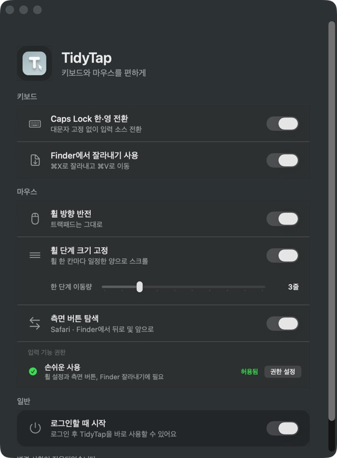

# TidyTap

맥에서 Caps Lock으로 한·영을 전환하고, 마우스 스크롤과 측면 버튼을 조절하고, Finder에서 `⌘X`로 파일을 잘라내세요. TidyTap은 필요한 기능만 골라 쓸 수 있는 무료 오픈소스 앱입니다.

**[Mac용 다운로드](https://github.com/Sharknia/TidyTap/releases/latest)** · [English](README.md)

Apple Silicon · macOS 15.1 이상 · 한국어·영어 · [MIT 라이선스](LICENSE)

  

## 어떤 기능이 있나요?

| 기능 | 사용 방법 |
| --- | --- |
| Caps Lock 한·영 전환 | 대문자 고정 대신 한국어·영어 등 두 입력 소스를 전환합니다. |
| 마우스 휠 방향 반전 | 마우스의 세로 스크롤 방향만 바꿉니다. 트랙패드는 그대로입니다. |
| 휠 이동량 조절 | 일반적인 휠 한 칸의 이동량을 1~10줄로 조절합니다. |
| 측면 버튼 | Safari·Finder에서 뒤로·앞으로 이동합니다. |
| Finder 잘라내기 | `⌘X`를 누르고 대상 폴더에서 `⌘V`로 파일을 이동합니다. `⌘C`는 그대로 복사입니다. |

> **창을 닫거나 `⌘Q`로 종료해도 켜둔 기능은 계속 작동합니다.** 완전히 멈추려면 앱에서 모든 기능을 꺼주세요. [종료·삭제 방법](#종료하거나-삭제하려면)

## 설치하기

1. [최신 릴리스](https://github.com/Sharknia/TidyTap/releases/latest)의 **Assets**에서 `.dmg` 파일을 받습니다.
2. DMG를 열어 TidyTap을 Applications(응용 프로그램)로 드래그하고, 응용 프로그램 폴더에서 실행합니다.
3. 원하는 기능을 켭니다. 권한 안내가 나오면 앱의 권한 설정 버튼을 눌러 TidyTap의 손쉬운 사용 권한을 허용하세요.

로그인 후에도 사용하려면 앱에서 "로그인할 때 시작"을 켜세요. Intel Mac용 빌드는 제공하지 않습니다. macOS 15.1 이상을 대상으로 만들었으며, 실제 테스트는 macOS 26.5.2에서 진행했습니다.

## 알아두면 좋은 점

- 측면 버튼은 사용 중인 Safari·Finder 창에서만 작동합니다.
- Finder 잘라내기는 바탕화면·다른 파일 관리자·우클릭 붙여넣기에서는 작동하지 않습니다. 이동을 취소했다면 다시 `⌘X`를 눌러주세요.
- Scroll Reverser 같은 앱을 함께 쓴다면 겹치는 기능은 한쪽에서 꺼주세요.
- VIA 등에서 Caps Lock 키를 이미 바꿨다면 TidyTap의 Caps Lock 기능은 꺼두세요.
- 메뉴 막대 아이콘은 없습니다. 설정을 바꾸려면 응용 프로그램 폴더에서 TidyTap을 여세요.

## 자주 묻는 질문

손쉬운 사용 권한은 왜 필요한가요? 입력을 수집하나요?

스크롤·측면 버튼·Finder 단축키를 처리하려면 macOS의 손쉬운 사용 권한이 필요합니다. Caps Lock 전환만 쓴다면 필요하지 않습니다. 입력 모니터링에 별도로 추가할 필요도 없습니다.

TidyTap은 키보드·마우스 입력을 기록하거나 전송하지 않습니다. 입력은 맥 안에서 처리하고, 설정과 복원용 백업도 맥에 보관합니다. 사용 분석이나 자동 업데이트 확인은 하지 않습니다.

권한은 시스템 설정 → 개인정보 보호 및 보안 → 손쉬운 사용에서 변경할 수 있습니다.

다른 마우스도 쓸 수 있나요? 트랙패드에는 영향이 없나요?

트랙패드 스크롤 방향은 바꾸지 않습니다. 마우스는 제조사에 따라 제한하지 않지만, 입력을 전달하는 방식에 따라 동작이 다를 수 있습니다. 휠을 빠르게 돌릴 때는 설정한 줄 수와 이동량이 다를 수 있으며 가로 스크롤은 바꾸지 않습니다.

마우스가 입력을 전달하는 방식에 따라 호환성이 달라집니다. [호환성 안내](docs/TROUBLESHOOTING.ko.md#기기-호환성)를 참고하세요.

업데이트는 어떻게 하나요? Homebrew로 설치할 수 있나요?

자동 업데이트와 공식 Homebrew 설치는 지원하지 않습니다. 아래 방법으로 TidyTap을 종료한 뒤 최신 DMG를 받아 응용 프로그램 폴더의 앱을 교체하세요. 다시 실행해 원하는 기능을 켜면 됩니다.

## 종료하거나 삭제하려면

1. 다섯 가지 입력 기능과 "로그인할 때 시작"을 모두 끕니다.
2. "변경 사항이 적용되었습니다"가 표시되면 Caps Lock과 한·영 전환이 사용 전처럼 동작하는지 확인하고 `⌘Q`로 종료합니다.
3. 삭제하려면 응용 프로그램 폴더의 TidyTap을 휴지통으로 옮깁니다.

**앱부터 삭제하면 설정이 자동으로 복원되지 않습니다.** 오류가 뜨거나 기능이 계속 작동한다면 [종료와 복원 상태 확인](docs/TROUBLESHOOTING.ko.md#종료와-복원-상태-확인)을 따라주세요. 전용 제거 프로그램은 없습니다.

## 문제가 생겼나요?

앱 하단의 상태 메시지와 손쉬운 사용 권한을 먼저 확인하세요. 스크롤이 어색하면 다른 마우스 앱에서 같은 기능을 사용 중인지 확인해보세요.

[문제 해결 안내](docs/TROUBLESHOOTING.ko.md)로 해결되지 않으면 [버그를 제보](https://github.com/Sharknia/TidyTap/issues/new)해주세요. macOS·앱 버전, 마우스 모델과 재현 방법을 알려주시면 도움이 됩니다. 이메일: [zel@kakao.com](mailto:zel@kakao.com)

빌드·테스트·구현 상세는 [개발 문서](docs/DEVELOPMENT.ko.md)에 있습니다.
