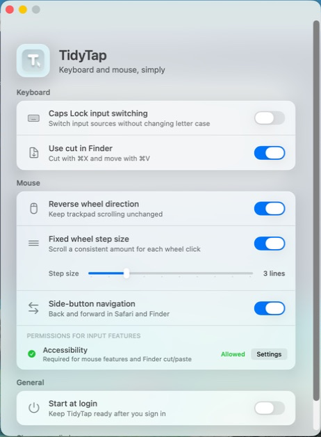

# TidyTap

Switch languages with Caps Lock, adjust your mouse wheel, use side buttons in Safari and Finder, cut files with `⌘X`, and reuse clipboard history. TidyTap is a free, open-source Mac app. Turn on the features you want and leave the rest off.

**[Download for Mac](https://github.com/Sharknia/TidyTap/releases/latest)** · [한국어](README.ko.md)

Apple silicon · macOS 15.1+ · English & Korean · [MIT license](LICENSE)

  

## What can it do?

| Feature | How it works |
| --- | --- |
| Caps Lock language switch | Switch between two input sources, such as English and Korean, instead of enabling Caps Lock. |
| Reverse mouse scrolling | Reverse vertical mouse scrolling. Your trackpad stays the same. |
| Wheel scroll amount | Adjust ordinary single wheel steps to scroll 1 to 10 lines. |
| Side buttons | Go back and forward in Safari and Finder. |
| Finder cut & paste | Press `⌘X`, open the destination folder, then press `⌘V` to move files. `⌘C` still copies. |
| Clipboard history | Set a shortcut, search copied text and images, and press `Enter` to paste. |

Clipboard history is off until you enable it and record a shortcut. Settings suggests `⌥V` but does not assign it. Text pastes without formatting by default; `Shift+Enter` uses the opposite style. When the paste key event is posted successfully, that history item moves to the top. See the [validation scope](docs/CLIPBOARD_HISTORY_ACCEPTANCE_STATUS.md).

> **Closing the window or quitting with `⌘Q` keeps enabled features running.** To stop them, turn off all features in the app. [How to stop or uninstall](#stopping-or-uninstalling)

## Install

1. Under **Assets**, download the `.dmg` file from the [latest release](https://github.com/Sharknia/TidyTap/releases/latest).
2. Open the DMG, drag TidyTap into Applications, then open it from there.
3. Turn on the features you want. If the app asks for permission, use its permission button to allow Accessibility access for TidyTap.

Enable "Start at login" to use your settings after signing in. There is no Intel Mac build. TidyTap targets macOS 15.1 or later; testing has been on macOS 26.5.2.

## A few things to know

- Side buttons work only in the Safari or Finder window you are using.
- Finder cut & paste does not work on the desktop, in other file managers, or through context-menu paste. If you cancel a move, press `⌘X` again.
- If you also use an app like Scroll Reverser, turn off overlapping features in one of the apps.
- If VIA or another tool already remaps Caps Lock, leave TidyTap's Caps Lock feature off.
- There is no menu-bar icon. Open TidyTap from Applications to change your settings.

## Questions

Why does it need Accessibility access? Does it collect my input?

macOS requires Accessibility access to handle scrolling, side buttons, Finder shortcuts, and the clipboard history shortcut/paste. Caps Lock switching alone needs no permission. You do not need to add TidyTap separately to Input Monitoring. Clipboard reading is checked separately when you enable history.

TidyTap does not record or transmit keystrokes or mouse activity. It processes input on your Mac and keeps settings and restoration backups there too. There is no analytics.

Enabling clipboard history separately stores newly copied supported text and images on this Mac for a 7-day retention period, up to 100 items and 50 MiB total (10 MiB per item). Recopying identical content or using an item through history renews its 7-day period. Turning the feature off stops collection but keeps existing entries until they expire. Expired files are removed on the next copy, history open, or settings open; they may remain on disk while TidyTap is not running. Source-marked concealed, transient, or auto-generated clipboard items are skipped, but unmarked sensitive content may be stored. During first activation, macOS may allow one read of the current clipboard to check access; that content is not added to history.

Updater-enabled versions check a public GitHub feed for new releases; input and clipboard history are never sent with that request.

You can change the permission in System Settings → Privacy & Security → Accessibility.

Can I use other mice? Will it affect my trackpad?

TidyTap leaves your trackpad's scroll direction alone. It does not restrict mice by brand, but behavior can vary with how a mouse reports input. Fast wheel scrolling may move farther than your chosen line count. Horizontal scrolling is unchanged.

Compatibility depends on how your mouse reports input. See [compatibility notes](docs/TROUBLESHOOTING.md#device-compatibility).

How do I update? Can I install with Homebrew?

Version 0.1.4 and earlier need one manual DMG replacement to gain in-app updates. Starting with 0.2.0, TidyTap checks for new releases while its app process is running and offers **Check for Updates** in Settings. Installing an update requires your click. There is no official Homebrew installation.

## Stopping or uninstalling

1. Turn off all five input features, clipboard history, and "Start at login". To remove saved history too, use **Clear all history** while clipboard history is still on, before turning it off.
2. Wait for the app to report that changes were applied. Check that Caps Lock and language switching work as they did before, then quit with `⌘Q`.
3. To uninstall, move TidyTap from Applications to the Trash. Deleting the app alone does not remove saved clipboard history from `~/Library/Application Support/com.sharknia.TidyTap/clipboard-history`.

**Deleting the app first will not automatically restore your settings.** If you see an error or features keep running, follow [the shutdown and restoration checks](docs/TROUBLESHOOTING.md#check-shutdown-and-restoration). There is no dedicated uninstaller.

## Need help?

Check the status message at the bottom of the app and its Accessibility permission first. If scrolling feels wrong, check whether another mouse app is adjusting it too.

If the [troubleshooting guide](docs/TROUBLESHOOTING.md) does not help, [report a bug](https://github.com/Sharknia/TidyTap/issues/new) with your macOS and app versions, mouse model, and steps to reproduce it. You can also email [zel@kakao.com](mailto:zel@kakao.com).

Build commands, tests, and implementation details are in [Development](docs/DEVELOPMENT.md).
