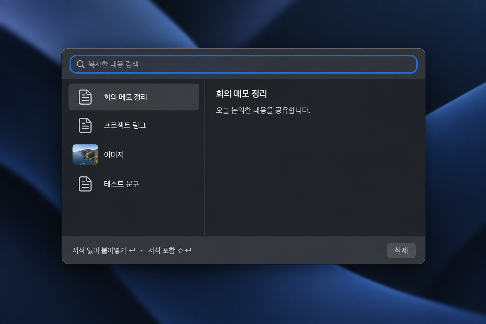
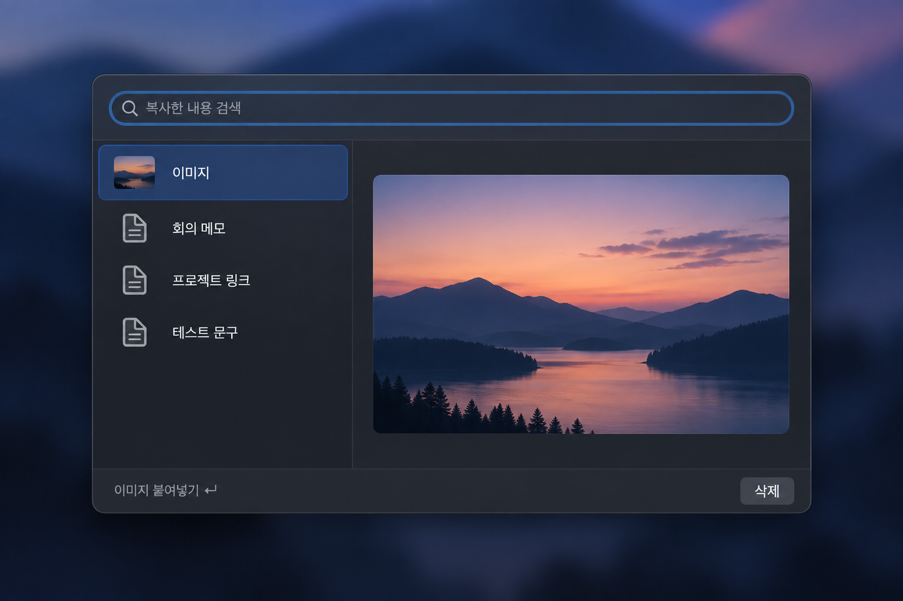

# 클립보드 히스토리 패널 재설계 작업계획

- 작성일: 2026-09-28
- 범위: 히스토리 **패널의 화면 구성과 사용성**. [MVP URS](CLIPBOARD_HISTORY_URS.md)의 수집·검색·붙여넣기 동작과 설정 정책은 유지한다.
- 선택한 방향: 검색 상단, 왼쪽 목록, 오른쪽 미리보기, 아래 짧은 붙여넣기 안내로 구성된 **단일 패널**. 아래 두 이미지는 별도 디자인안이 아니라 텍스트/이미지 선택 상태다.
- 제외: 다크·라이트 모드별 맞춤 디자인은 추후 작업으로 둔다. 이번 시안은 어두운 외관만 나타내며 실제 패널은 시스템 외관을 상속한다.
- 상태: 구현·로컬 프리뷰 검증 중. 기준별 통과 범위는 [수용 현황](CLIPBOARD_HISTORY_ACCEPTANCE_STATUS.md)에 기록한다.

## 예상 화면

| 텍스트 선택 | 이미지 선택 |
| --- | --- |
|  |  |

두 이미지는 구현 화면을 캡처한 것이 아니라 **배치·밀도·위계의 참고 시안**이다. 검색 초점 테두리가 창 안에 머무르고, 같은 목록에서 선택만 바꾸면 오른쪽 미리보기가 텍스트/이미지로 전환되는 구조를 따른다. 짧은 텍스트에서 남는 공백은 실제 패널 크기와 미리보기 배치 조정으로 더 줄인다.

## 목표와 근거

사용자가 저장한 단축키로 히스토리 **패널 하나만** 열고, 곧바로 검색하거나 선택 항목을 붙여넣을 수 있는 간결한 화면으로 만든다. 초기 격리 시험에는 `⌥C`를 썼고 현재 설정은 `⌥V`를 추천하지만 자동 등록하지 않는다. Raycast는 검색·목록·미리보기의 정보 구조만 참고한다. 유형 필터, 출처·시각·글자 수, 별도 복사 명령, 액션 메뉴는 추가하지 않는다.

사용자 화면에서는 제목 표시줄의 빈 영역과 신호등 버튼, 검색 포커스 테두리의 제목 표시줄 침범, 대비가 강한 두 직사각형과 상시 보이는 스크롤바, 짧은 항목 하나에 비해 큰 빈 공간이 확인됐다. 초기 패널은 `fullSizeContentView`인 760×520 창에 검색창을 루트 상단 24pt로 고정하고, 목록·미리보기에 각각 불투명 스크롤 뷰를 배치했다. [패널 코드](../Sources/App/ClipboardHistoryPanelController.swift)에서 이 레이아웃과 창 크기·재질을 바로잡는다. 복사/붙여넣기 오류나 중복 실행 문제를 시각 변경만으로 해결했다고 간주하지 않는다.

Apple의 [macOS 27 AppKit 세션](https://developer.apple.com/videos/play/wwdc2026/289/), [Liquid Glass 도입 가이드](https://developer.apple.com/documentation/technologyoverviews/adopting-liquid-glass), [재질 HIG](https://developer.apple.com/design/human-interface-guidelines/materials), [패널 HIG](https://developer.apple.com/design/human-interface-guidelines/panels)를 적용 기준으로 삼는다. 특히 Liquid Glass는 조작·탐색 계층에 절제해 사용하고, 기록 목록과 미리보기에는 가독성 높은 표준 재질을 쓴다. 이 패널은 창 버튼을 숨긴 투명 제목 표시줄 안에 검색창을 배치하되, 포커스 링이 창 모서리와 겹치지 않는 안쪽 여백을 둔다. macOS 27의 새 효과나 모서리 API를 구현 전제로 두지 않는다. 현재 개발 환경은 macOS 26.5.2·SDK 26.5이고 앱의 최소 지원 버전은 macOS 15.1이므로, 27 전용 API는 SDK와 실제 OS를 확보한 뒤 별도 검토한다.

macOS 27의 [시스템 Liquid Glass 조절 슬라이더](https://developer.apple.com/videos/play/wwdc2026/102/)는 앱의 별도 설정으로 복제하지 않는다. 기본 `NSGlassEffectView`는 슬라이더 설정을 자동 상속한다. 기존 설정 화면의 수동 틴트·테두리를 제거하고, 히스토리 패널은 시스템 외관을 상속한다. macOS 26에서는 기본 AppKit 글래스를 사용하고, 기존 최소 지원 버전에서는 표준 표면으로 돌아간다. 27에서의 실제 슬라이더 반응은 해당 OS·SDK가 준비된 뒤 확인한다.

## 화면 계약

| 영역 | 목표 |
| --- | --- |
| 창 | 별도의 설정 창·일반 앱 창 없이, 작업 중인 화면 위에 보조 패널만 표시. 기록에 이미지가 있으면 **열 때** 충분한 미리보기 높이를 잡되, 항목 선택을 바꿀 때 창 크기는 변하지 않음. 검색 포커스 링과 제목 표시줄/창 버튼이 겹치지 않음. |
| 검색 | 상단의 한 검색창이 첫 포커스를 받고, 클릭 없이 바로 입력. 포커스·입력 중에도 테두리가 패널 안에서 완전히 보임. |
| 목록 | 최신 항목을 맨 위·기본 선택. 텍스트는 작은 문서 심벌, 이미지는 식별 가능한 썸네일과 한 줄 요약, 절제된 선택 강조. 짧은 목록에는 불필요한 스크롤바나 검은 빈 면이 두드러지지 않음. |
| 미리보기 | 선택한 텍스트·이미지를 오른쪽에 읽기 쉬운 크기로 표시. 이미지는 원본 비율을 유지하며 정해진 미리보기 영역 안에서 가능한 크게 표시. 긴 내용은 영역 안에서 스크롤. 빈 기록·검색 결과 없음·용량 초과는 구별되는 상태로 표시. |
| 하단 | 현재 기본 붙여넣기 방식과 `Enter`/`Shift+Enter`만 짧게 안내. 기존 삭제 기능은 유지하되 주 동작보다 시각적으로 앞서지 않게 배치. |

숫자 크기나 불투명도보다 **실제 화면에서의 균형과 가독성**을 우선한다. 시스템 글꼴·의미 색상·기본 선택/접근성 동작을 재사용한다. 투명도 줄이기와 대비 증가에서도 텍스트·선택 상태가 명확해야 한다. 색상 모드별 별도 디자인은 이번 범위에서 제외한다.

## 작업 순서

1. **기준 화면 확보:** 실제 사용자 기록과 클립보드를 읽지 않는 기존 [오프스크린 렌더 테스트](../Tests/TidyTapTests/SettingsViewControllerTests.swift)로 텍스트·이미지의 전/후 화면을 남긴다. 0개, 1개, 여러 개, 긴 텍스트, 이미지, 검색 결과 없음도 시험 데이터로 확인한다.
2. **창과 초점 수정:** 제목 표시줄·창 버튼 정책을 정리하고 검색창을 투명 제목 표시줄 안쪽에 충분히 띄워 배치한다. `⌥C` 호출 시 히스토리 패널만 보이는지, 검색 포커스 링이 잘리지 않는지 먼저 통과시킨다. 패널 크기와 작은 화면에서의 위치를 조정한다.
3. **콘텐츠 재배치:** 하나의 차분한 콘텐츠 표면 위에 목록과 미리보기를 구분한다. 행 높이·여백·선택 강조·이미지 썸네일·빈 상태·스크롤바를 다듬는다. 재질은 콘텐츠를 가리지 않는 범위에서 시스템 제공 뷰를 우선 사용한다.
4. **조작 회귀:** 검색, 한글 조합, ↑/↓, 한 번 클릭, Enter/Shift+Enter, 두 번 클릭, Esc, 호출 키 재입력, 삭제의 기존 동작을 유지한다. 열기·탐색·취소만으로 클립보드가 바뀌지 않는지도 확인한다.
5. **시각·접근성 검증:** 선택한 어두운 외관에서 투명도 줄이기·대비 증가, 짧고 긴 데이터, 이미지, 좁은 디스플레이와 전체 화면을 캡처해 시안과 비교한다. 키보드만으로 조작 가능한지와 VoiceOver 레이블을 확인하고, 실제 앱에서 입력 위치 복귀·한 번 붙여넣기를 재검증한다. 결과를 [수용 기준 현황](CLIPBOARD_HISTORY_ACCEPTANCE_STATUS.md)에 통과·실패·미실행으로 기록한다.

## 완료 기준과 작업 경계

- 검색 포커스 테두리가 제목 표시줄이나 창 경계와 겹치지 않고, 목록·미리보기는 짧은 기록에도 허전한 검은 면과 불필요한 스크롤바가 지배하지 않는다.
- 사용자 설정 단축키에는 히스토리 패널 하나만 나타나며, 검색·선택·미리보기·붙여넣기·닫기 흐름이 [URS](CLIPBOARD_HISTORY_URS.md)와 같다. 단순 렌더링 성공만으로 실제 붙여넣기까지 통과했다고 기록하지 않는다.
- macOS 15.1 이상에서 동작하는 구현을 유지한다. macOS 27 전용 외관은 추후 실제 SDK/OS에서 별도 확인한다.
- 기존 설치 앱과 충돌할 수 있는 동일 번들 ID의 임시 앱을 무심코 띄우지 않는다. 현재 별도로 진행 중인 중복 실행 판별 안전 수정은 이 패널 디자인 범위와 분리하고, 먼저 격리된 렌더 테스트로 검증한다.
- 완료 시 변경 파일만 커밋·푸시하고 승인된 로컬 프리뷰 DMG를 설치·검증한다. 자동 업데이트 배포와 공개 릴리스는 포함하지 않는다.
