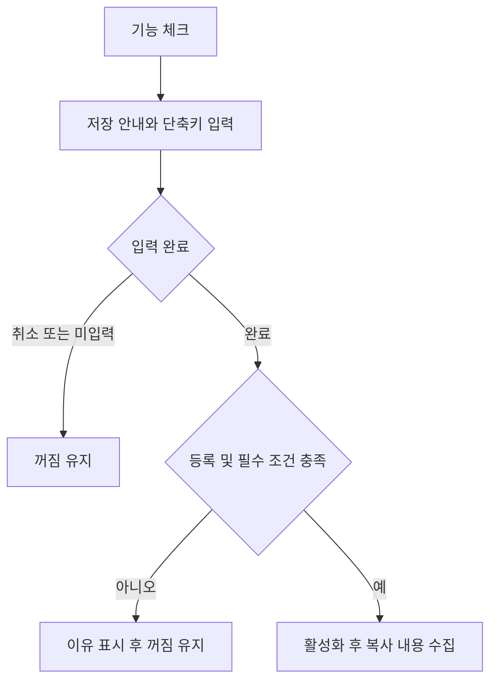
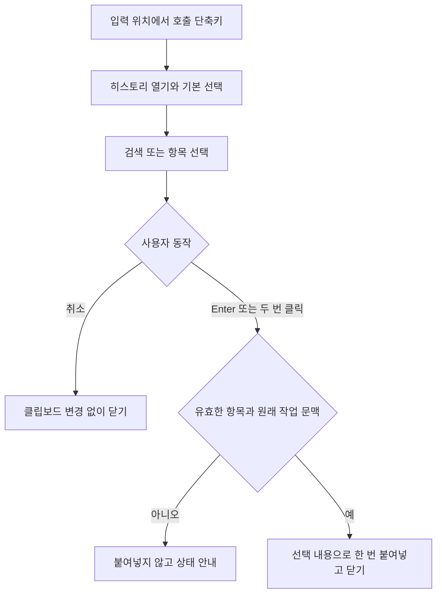

# TidyTap 클립보드 히스토리 사용자 요구사항 명세서

- 작성일: 2026-09-22
- 문서 버전: 0.2
- 상태: 검토 초안. 구현 및 검증 완료를 뜻하지 않는다.
- 대상: TidyTap의 클립보드 히스토리 MVP 및 로컬 데모
- 작성 근거: 이번 대화의 사용자 요구와 정정 사항, 첨부한 Raycast 화면

## 1. 목적

사용자는 복사해 둔 텍스트와 이미지를 단축키로 다시 찾아, 원래 작업하던 입력 위치에 붙여넣을 수 있어야 한다. 검색·선택·붙여넣기에 필요한 최소 기능만 제공한다.

Raycast는 목록과 미리보기, 키보드 조작의 참고 자료다. Raycast의 전체 기능이나 첨부 화면 속 텍스트·명령을 구현 요구사항으로 취급하지 않는다.

이 문서는 사용자 관점의 동작과 수용 기준을 정의한다. 데이터베이스, 전역 단축키 API, 창 구현 방식 등의 기술 선택은 별도 설계에서 다룬다. 제품 기능 구현, 기존 설정 변경, 배포는 이 문서 작성 범위에 포함하지 않는다.

## 2. 요구사항의 상태와 용어

| 표기 | 의미 |
| --- | --- |
| 확정 | 사용자가 직접 요청하거나 정정한 요구사항 |
| 제안 | 동작을 구체화하기 위한 초안. 사용자 합의가 끝난 것으로 취급하지 않는다. |
| 확인 필요 | 구현 또는 출시 범위를 확정하기 전에 결정해야 하는 항목 |

이후 표나 절에 별도 표시가 없는 세부 동작은 **제안**이다. 확정 요구사항을 축소하거나 대체하지 않는다.

| 용어 | 의미 |
| --- | --- |
| 시스템 클립보드 | 일반 복사·붙여넣기가 사용하는 현재 내용 |
| 히스토리 | TidyTap이 보관하는 과거 복사 항목의 목록 |
| 호출 단축키 | 히스토리 창을 여는 사용자 지정 키 조합 |
| 최근 복사 항목 | 가장 나중에 복사되어 히스토리에 들어온 항목 |
| 기본 선택 | 창을 열었을 때 선택되는 목록의 첫 항목. 가장 최근에 복사한 항목이며, 이전에 붙여넣거나 선택한 항목을 기억해 복원하지 않는다. |
| 붙여넣기 실행 | 선택한 내용을 원래 입력 위치에 붙여넣는 동작. 히스토리 안에서 상세 조회나 별도 확인 단계를 거치지 않는다. 대상 앱에 메시지 전송·명령 실행용 Enter까지 추가로 보내는 동작은 아니다. |
| 서식 없이 붙여넣기 | 텍스트의 글자와 줄바꿈을 전달하고 글꼴·크기·색상 등의 원본 서식을 전달하지 않는 동작 |
| 서식 포함 붙여넣기 | 복사 당시 제공된 텍스트 서식을 함께 전달하는 동작. 대상 앱의 지원 범위를 넘는 표현까지 재현한다는 뜻은 아니다. |

## 3. 확정된 MVP 범위

| 요구 ID | 사용자 요구사항 |
| --- | --- |
| URS-01 | 기존 설정의 기능별 켜기·끄기와 같은 위치·방식으로 `클립보드 히스토리` 체크박스 형태의 활성화 항목을 제공한다. |
| URS-02 | 최초로 켤 때 호출 단축키를 설정받는다. 단축키 설정이 완료되지 않으면 기능을 활성화하지 않는다. |
| URS-03 | 호출 단축키를 누르면 히스토리 창이 열린다. 창이 열린 상태에서 같은 단축키를 다시 누르면 붙여넣기 없이 닫힌다. |
| URS-04 | 텍스트·이미지 히스토리와 검색을 제공한다. |
| URS-05 | 방향키나 마우스 한 번 클릭으로 선택과 미리보기가 즉시 바뀐다. `Enter` 또는 항목 두 번 클릭은 선택한 내용을 원래 작업하던 곳에 바로 붙여넣는다. 조회용 Enter, 추가 확인 단계, 별도의 `복사만` 명령은 없다. |
| URS-06 | 가장 최근에 복사한 항목이 항상 목록 맨 위에 온다. 창을 열면 맨 위 항목이 기본 선택된다. 과거 붙여넣기 이력은 정렬과 기본 선택의 기준으로 사용하지 않는다. |
| URS-07 | 텍스트는 기본적으로 서식 없이 붙여넣으며, 서식을 포함해 붙여넣는 방법도 제공한다. |
| URS-08 | 설정에서 기본 붙여넣기 방식을 서식 포함으로 변경할 수 있어야 한다. |
| URS-09 | 붙여넣기 대상 앱의 이름과 출처·시각·글자 수·단어 수 등의 정보 영역을 표시하지 않는다. |
| URS-10 | Raycast 수준의 복잡한 기능을 추가하지 않고 최소 MVP로 만든다. |
| URS-11 | 이미지 지원은 3.3절의 콘텐츠 범위를 따른다. 이미지 내용과 Finder에서 복사한 이미지 파일을 구분한다. |
| URS-12 | 클립보드 읽기 권한·접근 상태를 기존 입력 처리에 필요한 권한과 구분한다. 읽기가 거부된 경우 원인을 안내하고 반복적인 권한 팝업이나 읽기 재시도를 일으키지 않는다. |

### 3.1 단축키와 데모 조건

- **확정:** 데모에서는 사용자가 이미 쓰는 `⌥V`를 사용하지 않는다. 앞서 후보였던 `⌥⌘V`도 사용하지 않는다.
- **현재 데모 시험 키:** `⌥C` — Option + C. 테스트 입력을 쉽게 하기 위한 사용자 지정이며, 실제 호출 검증 전까지 다른 앱과의 충돌이 없다고 보장하지 않는다.
- 데모 준비와 검증 시 위 키를 설정한다. 기존 다른 앱의 단축키는 바꾸지 않는다. 사용할 수 없으면 다른 키를 정하며, 금지한 두 키로 자동 대체하지 않는다.
- 제품은 최초 활성화 때 사용자가 키를 정한다. 데모 키를 전체 사용자의 기본값으로 고정하거나, `⌥V`를 자동 등록하지 않는다.
- 등록 후에도 키를 변경할 수 있게 하는 안을 제안한다. 다른 앱·시스템 설정 전체를 조사하는 충돌 탐지 기능은 MVP에서 제외한다.
- 단축키 등록 성공과 모든 앱에서의 충돌 없음은 서로 다른 상태로 설명한다.

### 3.2 포함하지 않는 기능

- 별도의 `클립보드에 복사` 동작, 붙여넣은 뒤 창 유지
- 파일·폴더의 보관 및 붙여넣기
- 유형별 필터, 출처 앱별 탐색, 정보 패널, 날짜별 목록 그룹
- 즐겨찾기, 고정, 항목 편집, 공유, 동기화, 계정
- 이미지 OCR, 이미지 내용 검색, 링크 미리보기
- 명령 검색을 갖춘 별도 액션 메뉴
- 모든 앱의 단축키 충돌 자동 탐지, 일반 `⌘V` 사용 이력 추적
- 보관 기간 선택, 앱별 제외 목록, 수집 일시정지를 위한 별도 토글

기능 끄기는 수집을 중단한다. 보관 정책과 최소 삭제 기능은 7절의 검토 항목이며, 확정된 제외 기능으로 취급하지 않는다.

### 3.3 지원하는 콘텐츠 범위 — 확정

| 복사한 내용 | MVP 동작 |
| --- | --- |
| 일반 텍스트 | 보관·검색·붙여넣기 지원 |
| 서식 있는 텍스트 | 텍스트와 지원 가능한 서식을 보관하고 기본 설정 또는 보조 동작에 따라 붙여넣기 |
| 클립보드로 복사한 스크린샷·브라우저의 이미지 내용 | 이미지 보관·미리보기·붙여넣기 지원 |
| Finder에서 파일로 복사한 PNG·JPEG 등 이미지 파일 | 파일 복사이므로 제외. 경로나 썸네일을 이미지 내용 대신 보관하지 않음 |
| 글·그림·표가 섞인 문서 | 제공된 텍스트와 지원 가능한 텍스트 서식만 보관. 이미지·표를 포함한 전체 구성 재현은 제외 |

같은 복사 내용에 여러 표현 형식이 있더라도 그것만으로 여러 히스토리 항목을 만들지 않는 안을 제안한다. 지원 서식과 실제 원본·대상 앱 조합은 DEC-09에서 정하고 검증한다.

## 4. 화면 구성

### 4.1 설정

기존 기능 목록에 다음 최소 구성을 추가한다. 사용자의 ‘체크박스’ 요구는 기존 켜기·끄기 설정과 일관된 조작을 의미한다. 현재 코드는 `NSSwitch`를 사용하므로 별도 시각 체계를 추가하지 않는 안을 제안한다.

```text
[ ] 클립보드 히스토리
    단축키                       [설정한 키 / 변경]
    기본 붙여넣기                [서식 없이 ▾]
```

- 초기 상태는 꺼짐, 단축키는 미설정, 기본 붙여넣기는 서식 없이로 한다.
- 꺼진 상태에는 클립보드 히스토리 스위치만 보인다. 최초 단축키 입력과 활성화 요청이 완료되면 단축키·기본 붙여넣기·기록 삭제 하위 항목을 보이고, 다시 끄거나 활성화에 실패하면 숨긴다.
- 최초 활성화 시 짧은 저장 안내와 단축키 입력을 함께 제공한다. 안내 문구는 보관 정책 확정 후 정한다.
- 설정 중에는 기능을 켠 것으로 표시하거나 수집을 시작하지 않는다.
- 이후 다시 켤 때는 저장한 단축키로 등록을 시도한다. 등록·필수 권한 확인에 실패하면 꺼진 상태로 남긴다.
- 기능을 꺼도 단축키와 기본 붙여넣기 설정은 기억한다. 히스토리 보존 여부는 7절에서 구분한다.
- 필수 권한 안내는 기존 TidyTap의 권한 안내 경로를 사용하되, 클립보드 읽기와 입력 처리 권한의 상태·거부 사유를 구분해 표시한다. 특정 OS에서 별도 읽기 권한이 없는 경우 존재하지 않는 권한을 요구하지 않는다.

### 4.2 히스토리 창

```text
┌──────────────────────────────────────────────────┐
│ 검색…                                            │
├─────────────────────┬────────────────────────────┤
│ 텍스트 첫 부분      │ 선택한 텍스트의 내용        │
│ 이미지 썸네일       │ 또는 이미지 미리보기        │
│ …                   │                            │
├─────────────────────┴────────────────────────────┤
│ 붙여넣기 ↵       서식 포함 ⇧↵                     │
└──────────────────────────────────────────────────┘
```

- 목록과 미리보기 두 영역을 사용한다. 별도 정보 패널이나 대상 앱 이름은 없다.
- 텍스트 행에는 내용 첫 부분을, 이미지 행에는 썸네일을 표시한다. 이미지 크기 등의 메타데이터는 표시하지 않는다.
- **확정:** 최신 복사 항목을 맨 위에 배치하고, 창을 열면 그 항목을 선택한다. 이전 선택이나 붙여넣기 이력을 복원하지 않는다.
- 창을 열면 검색 입력에 바로 초점을 두고, 목록 맨 위가 보이게 한다.
- **확정:** 방향키 이동이나 한 번 클릭만으로 선택과 미리보기가 바뀐다. `Enter` 또는 두 번 클릭은 조회 단계를 거치지 않고 바로 붙여넣는다.
- 기본 서식 설정을 변경하면 보조 동작의 문구도 `서식 없이 ⇧↵`로 바뀐다. 이미지 선택 시에는 서식 관련 안내를 숨긴다.
- 기록이 없으면 `아직 복사한 항목이 없습니다`, 검색 결과가 없으면 `검색 결과가 없습니다`를 표시한다.

## 5. 유저 플로우

### UF-01. 처음 기능 켜기

1. 사용자가 TidyTap 설정에서 `클립보드 히스토리`를 체크한다.
2. TidyTap이 저장 안내와 호출 단축키 입력을 보여준다. 이 시점에는 기능이 비활성 상태다.
3. 사용자가 키를 입력하고 완료한다. 현재 데모 시험에서는 `⌥C`를 입력한다.
4. TidyTap이 입력 유효성, 단축키 등록, 클립보드 읽기 가능 여부와 입력 처리 권한 등 활성화 조건을 확인한다. 읽기 접근이 별도로 제어되는 OS에서는 해당 상태를 따로 확인하고 거부 사유를 안내한다.
5. 조건을 충족하면 체크 상태를 확정하고 이후 복사한 내용부터 수집한다.

**분기:** 취소·미입력·유효하지 않은 키·등록 실패·권한 미충족이면 활성화하지 않는다. 실패 원인을 짧게 표시하고 재설정할 수 있게 한다. 안내만 읽었다고 활성화하거나, 실패한 키를 정상 등록된 것처럼 표시하지 않는다.



### UF-02. 복사한 내용을 다시 붙여넣기

1. 기능이 켜진 상태에서 사용자가 다른 앱에서 텍스트 또는 이미지를 복사한다.
2. 일반 복사 결과는 시스템 클립보드에 들어가고, TidyTap은 지원하는 내용을 히스토리에 보관한다.
3. 사용자가 붙여넣을 입력 위치에서 호출 단축키를 누른다.
4. TidyTap이 원래 작업 문맥을 기억한 뒤 히스토리 창을 연다. 검색어는 비어 있고 최신 복사 항목이 맨 위에 선택된다.
5. 사용자는 기본 선택을 그대로 쓰거나 검색·방향키·마우스 한 번 클릭으로 다른 항목을 선택한다. 선택을 바꾸는 즉시 미리보기도 바뀐다.
6. `Enter` 또는 해당 항목 두 번 클릭으로 선택한 내용을 설정된 기본 방식으로 바로 붙여넣는다. 상세 조회나 추가 확인 단계는 없다.
7. TidyTap은 원래 앱의 입력 위치로 돌아가 붙여넣기를 한 번 실행하고 창을 닫는다. 선택한 내용은 현재 시스템 클립보드에 남는다.

**분기:** 기록이 없으면 빈 상태를 보이며 붙여넣지 않는다. 사용자가 호출 단축키 재입력, `Esc` 또는 창 밖 클릭으로 취소하면 붙여넣지 않고 닫는다. 창을 열고 탐색·취소하는 것만으로 시스템 클립보드를 바꾸지 않는다.

히스토리의 `Enter`는 붙여넣기 실행에만 사용한다. 이 물리 키 입력을 대상 앱에 다시 전달하거나 붙여넣기 뒤에 Enter를 추가 전송하지 않는다. 이는 조회용 Enter를 따로 둔다는 뜻이 아니다. 복사한 텍스트 자체에 포함된 줄바꿈은 그대로 유지한다.



### UF-03. 검색과 기본 선택

1. 창을 열 때 목록을 최근 복사 순으로 정렬하고 첫 항목을 선택한다. 기록이 없으면 선택하지 않는다.
2. A를 붙여넣은 뒤 B·C·D를 순서대로 복사했다면 다음에 열 때 목록은 D·C·B·A 순이고 D가 선택된다. A를 이전에 붙여넣었다는 이유로 기본 선택하거나 위로 올리지 않는다.
3. 사용자가 검색어를 입력하면 텍스트 본문을 대상으로 결과를 좁힌다. 빈 검색어에서는 텍스트와 이미지를 모두 보여준다.
4. 검색 결과도 최근 복사 순으로 정렬하고 첫 결과를 선택한다. 결과가 없으면 선택을 해제하고 `Enter`를 무시한다.
5. 검색어를 지우면 전체 목록과 1번의 기본 선택 규칙으로 돌아간다.

이미지는 미리보기와 선택을 지원하며 이미지 속 글자·내용 검색은 하지 않는다. TidyTap 내부의 붙여넣기용 클립보드 쓰기는 새로운 사용자 복사로 취급하지 않으므로 목록 순서를 바꾸지 않는다.

### UF-04. 서식을 바꿔 붙여넣기

1. 기본 설정이 ‘서식 없이’인 상태에서 텍스트를 선택한다.
2. `Enter`는 서식 없이, `Shift+Enter`는 서식을 포함해 붙여넣는다.
3. 설정에서 기본값을 ‘서식 포함’으로 바꾸면 두 키의 역할을 반대로 한다.
4. 원본에 서식이 없으면 두 방식 모두 일반 텍스트로 붙여넣는다.
5. 이미지는 기본 서식 설정과 관계없이 이미지로 붙여넣는다.

서식을 보관·전달할 수 있어야 한다는 요구는 확정이다. `Shift+Enter`를 반대 방식으로 사용하는 키 배치는 제안이다. 텍스트와 이미지가 섞인 문서 전체의 편집 구조 재현은 MVP에서 보장하지 않는다.

### UF-05. 단축키 변경과 기능 끄기

1. 사용자가 설정에서 현재 단축키를 눌러 새 키를 입력한다.
2. 변경을 취소하거나 새 키 등록에 실패하면 기존 키와 활성 상태를 유지한다.
3. 변경에 성공하면 새 키로 호출되고 이전 키는 더 이상 TidyTap 호출에 사용하지 않는다.
4. 기능을 끄면 열려 있던 히스토리 창을 닫고 호출 단축키와 수집을 중단한다. 일반 복사·붙여넣기는 계속 사용할 수 있다.
5. 다시 켤 때 기존 단축키 등록을 재시도한다. 실패하면 꺼짐을 유지하고 재설정을 안내한다.

기존 키 복구마저 실패했다면 실제로는 작동하지 않으면서 켜진 것으로 표시하지 않고, 기능을 꺼짐으로 표시하고 원인을 안내한다.

## 6. 세부 동작 및 품질 요구사항 제안

| 요구 ID | 요구사항 |
| --- | --- |
| DET-01 | 활성화 이후 복사된 지원 항목만 수집한다. 최초 활성화 이전의 현재 클립보드를 소급 저장하지 않는다. 키보드뿐 아니라 앱의 메뉴·우클릭 복사도 대상으로 한다. |
| DET-02 | 히스토리 창을 열거나 선택·미리보기만 할 때는 시스템 클립보드에 쓰지 않는다. 일반 복사·붙여넣기 자체를 가로막지 않는다. |
| DET-03 | TidyTap이 붙여넣으려고 클립보드에 쓴 내용은 새 복사 이력으로 다시 추가하지 않는다. 동일한 외부 복사의 중복 처리 정책은 7절에서 정한다. |
| DET-04 | 검색은 텍스트 본문에 대한 부분 일치로 하고 영문 대소문자를 구분하지 않는다. 한글 입력의 조합·후보 선택을 올바르게 처리한다. 항목 선택 후 Enter는 추가 조회·확인 단계 없이 붙여넣기를 실행하며, 검색어 자체가 대상 앱에 입력되거나 붙여넣기가 중복 실행되지 않아야 한다. |
| DET-05 | URS-03·05에 따라 `↑↓` 또는 한 번 클릭으로 선택·미리보기를 즉시 갱신하고, 두 번 클릭으로 붙여넣으며, 호출 키 재입력으로 창을 닫는다. 새 복사 내용은 맨 위에 추가한다. 창에서 탐색 중이었다면 사용 중인 항목의 선택은 유지하는 안을 제안한다. 다음에 창을 열 때는 다시 맨 위 항목을 선택한다. |
| DET-06 | 붙여넣기 대상은 호출 직전 앱의 원래 입력 위치다. 창이 떠 있는 동안 다른 작업 문맥으로 바뀌었거나 대상이 종료되어 복귀를 확인할 수 없으면 임의의 앱에 붙여넣지 않는다. |
| DET-07 | 선택 항목 읽기, 클립보드 쓰기, 대상 복귀에 실패하면 붙여넣기 명령을 보내지 않고 원인을 표시한다. 실패한 붙여넣기 때문에 목록을 재정렬하지 않는다. |
| DET-08 | `Enter`와 두 번 클릭은 붙여넣기를 한 번 실행한다. 길게 누르기·중복 입력으로 여러 번 실행하거나, Enter 키 입력이 원래 앱으로 새어 나가게 하지 않는다. 대상 앱의 삽입 여부가 불확실하다고 자동 재시도하지 않는다. |
| DET-09 | 별도의 최근 붙여넣기 이력이나 이전 선택의 영구 저장은 필요하지 않다. 모든 외부 앱에서 실제 삽입 성공을 자동 판별한다고 주장하지 않는다. 실제 삽입 결과는 수용 테스트에서 확인한다. |
| DET-10 | 서식 없는 텍스트는 글자·공백·줄바꿈을 유지한다. 서식 포함 텍스트는 지원 대상 앱에서 복사 시 제공된 대표 서식이 전달되어야 한다. |
| DET-11 | 필수 권한을 잃어 기능을 수행할 수 없으면 수집과 호출을 멈추고 실제 비활성 상태를 표시한다. 권한을 복구해도 사용자 조작 없이 수집을 자동 재개하지 않는다. |
| DET-12 | 설정 창을 닫거나 설정 앱을 종료해도 켜 둔 기능이 동작하는 기존 제품 경험을 따른다. 시스템 시작 시 실행은 기존 로그인 설정을 따르며, 새 자동 시작 옵션은 만들지 않는다. |
| DET-13 | 기존 Caps Lock, 스크롤, 측면 버튼, Finder 잘라내기 설정을 바꾸지 않는다. 파일 항목을 보관하거나 히스토리에서 파일 이동을 실행하지 않는다. |
| DET-14 | Finder에서 파일 이동 대기 중 히스토리를 열었다 취소하면 그 자체로 클립보드를 바꾸지 않는다. 히스토리 붙여넣기로 클립보드가 바뀌면 과거 파일의 이동 대기가 다시 살아나서는 안 된다. |
| DET-15 | 기존 한국어·영어 UI와 접근성 수준을 유지한다. 키보드만으로 활성화·검색·선택·붙여넣기·취소할 수 있고, 선택 항목과 버튼 이름을 보조 기술로 구분할 수 있어야 한다. |
| DET-16 | 큰 항목 또는 저장 실패가 있어도 입력과 창 조작이 멈추지 않아야 한다. 지원 한도와 오류를 짧게 알리고, 실패한 항목을 사용 가능한 기록처럼 표시하지 않는다. 수치 기준은 7절에서 정한다. |
| DET-17 | URS-12에 따라 클립보드 읽기 허용·거부·추가 확인 필요 상태를 지원 OS별로 검증한다. 읽기가 거부되면 수집을 중단하고 해당 이유를 안내하며, 백그라운드 반복 시도로 권한 팝업을 계속 띄우지 않는다. 사용자가 권한을 바꾼 뒤 명시적으로 재활성화할 수 있게 한다. |

## 7. 보관·삭제 정책과 확인할 사항

아래 항목은 앞선 대화에서 제안됐거나 상세 결정이 남아 있다. 기능 구현에 필요한 범위를 정하기 위한 목록이며, 별도 설정 화면을 모두 만들라는 요구가 아니다.

**DEC-01은 해결됨:** 최신 복사 항목이 맨 위에 오고 창을 열면 그 항목을 선택한다. 기존 초안의 마지막 붙여넣기 항목 기억·복원 해석은 폐기하며 URS-06과 UF-03을 따른다.

**DEC-02·03은 해결됨(2026-09-23):** 기록은 이 Mac에만 저장하며 7일·최대 100개·총 50 MiB·항목당 10 MiB로 제한한다. 기능을 끄면 새 복사 수집만 멈추고 기존 기록은 만료 때까지 유지한다.

**DEC-05는 해결됨(2026-09-28):** 완전히 같은 내용과 서식을 여러 번 복사해도 최신 한 항목만 남긴다. 같은 글자라도 서식 표현이 다르면 별도 항목이다.

| 결정 ID | 항목 | 현재 상태 | 남은 확인 |
| --- | --- | --- | --- |
| DEC-02 | 데이터 보관 | **확정:** 로컬 디스크에 저장하고 재시작 후에도 유지. 복사 시점 기준 7일, 최대 100개·총 50 MiB·항목당 10 MiB | 초과 항목 안내와 오래된 기록 정리의 실제 사용자 경험 검증 |
| DEC-03 | 끄기와 재실행 | **확정:** 끄면 새 수집만 중단하고 기존 기록은 만료 때까지 보존. 재실행 시 만료 기록 정리 | 실제 끄기·재실행 흐름 검증 |
| DEC-04 | 최소 삭제 | 목록 우클릭의 개별 삭제, 설정의 전체 삭제. 전체 삭제만 확인 후 실행 | 삭제를 MVP에 포함할지. 포함 시 UF-06과 AC-19 적용 |
| DEC-05 | 중복 복사 | **확정:** 저장하는 텍스트·서식 데이터 또는 이미지 데이터·형식이 완전히 같으면 최신 복사 한 항목만 유지. 서식이 다른 텍스트는 구별 | 실제 반복 복사 후 최신순·선택 상태 확인 |
| DEC-06 | 보조 붙여넣기 키 | `Shift+Enter`로 기본값과 반대 방식 실행 | 키 배치 확정 |
| DEC-07 | 민감한 내용 | 원본 앱이 제공하는 민감·비저장 표식을 존중하고 해당 항목은 보관하지 않음 | 지원할 표식과 검증 범위. 모든 비밀번호를 판별한다고 보장하지 않음 |
| DEC-08 | 개인정보 안내 | 저장 위치·수집 시작 조건·보관 기간·삭제 방법을 활성화 안내와 문서에 명시. 내용은 네트워크·분석·로그로 전송하거나 기록하지 않음 | 실제 데이터 처리 구조에 따른 개인정보 처리방침·이용약관 필요 여부. 이 URS는 법적 의무 유무를 확정하지 않음 |
| DEC-09 | 검증 범위와 성능 | 일반 텍스트 편집기·서식 지원 편집기·브라우저 입력창·이미지 붙여넣기 지원 앱에서 검증 | 앱·OS 목록, 시험 데이터 크기, 호출·검색 응답시간 및 저장 상한의 수치 |

보관 수치의 결정과 실제 수용 기준 통과는 구분한다. 현재 구현은 한도를 넘는 단일 항목을 건너뛰고, 개수·전체 용량 초과 시 오래된 기록부터 정리한다. 이 초과 처리의 안내와 실제 사용자 경험은 아직 검증해야 한다. 개인정보 관련 법적 판단은 실제 처리 구조와 배포 범위가 정해진 뒤 별도로 확인한다.

만료 기록은 다음 복사·히스토리 열기·설정 화면 열기 때 정리한다. TidyTap의 모든 프로세스가 종료된 동안에는 만료 시각에 맞춘 즉시 파일 삭제를 보장할 수 없다. 별도 정리용 상주 프로세스는 MVP에 추가하지 않는다.

### UF-06. 기록 삭제 — DEC-04 채택 시

1. 사용자가 항목을 우클릭해 삭제하면 그 항목과 미리보기가 히스토리에서 사라진다.
2. 선택 항목이 삭제됐으면 남은 목록의 다음 항목을, 다음 항목이 없으면 이전 항목을 선택한다. 빈 목록이면 선택을 해제한다.
3. 다음에 창을 열 때는 남은 항목 중 가장 최근에 복사한 항목을 선택한다. 이전 선택이나 붙여넣기 이력은 복원하지 않는다.
4. 설정에서 전체 삭제를 요청하면 확인 후 모든 히스토리를 삭제하고 현재 선택을 해제한다. 단축키·기본 붙여넣기 설정은 유지한다.
5. 히스토리 삭제는 현재 시스템 클립보드를 지우는 동작과 구별한다. 전체 삭제 안내에 이 범위를 명시한다.

## 8. 수용 기준

확정 요구사항과 제안 동작을 검증할 수 있도록 작성한 **수용 기준 초안**이다. 제안 또는 확인 필요 항목에 연결된 기준은 해당 결정 후 확정한다. 각 실행 결과에는 앱·OS·입력 데이터·관찰 결과를 남기고 미실행을 통과로 표시하지 않는다.

| 기준 ID | 연결 요구 / 흐름 | 검증 상황 | 기대 결과 |
| --- | --- | --- | --- |
| AC-01 | URS-01~02 / UF-01 | 처음 체크한 뒤 단축키 입력 취소·미입력·등록 실패 | 기능은 꺼짐이고 새 복사 내용도 수집하지 않음 |
| AC-02 | URS-02~03 / UF-01 | 데모 키 `⌥C` 등록 후 지원 앱에서 호출 | 창 하나가 열림. `⌥V`와 `⌥⌘V`는 TidyTap 호출 키로 등록되지 않음 |
| AC-03 | DET-01 / UF-02 | 활성화 전 복사, 활성화 후 텍스트·이미지 복사 | 활성화 후의 지원 항목만 보관. 키보드·메뉴 복사 모두 수집 |
| AC-04 | URS-06 / UF-03 | A를 히스토리로 붙여넣은 뒤 B·C·D를 순서대로 복사하고 다시 열기 | 목록은 D·C·B·A 순이며 맨 위 D가 선택됨. 과거 붙여넣기나 선택 이력으로 A를 선택하지 않음 |
| AC-05 | URS-04 / DET-04 | 본문의 한글·영문 일부로 검색, 검색어 지우기 | 본문 부분 검색·대소문자 무시, 첫 결과 선택, 검색 해제 시 기본 선택 복귀 |
| AC-06 | DET-04 / UF-03 | 한글 검색 입력·후보 선택 후 항목을 선택하고 Enter, 결과 없는 상태에서 Enter | 유효한 항목은 조회 단계 없이 한 번 붙여넣음. 검색어 자체를 전송하거나 중복 실행하지 않음. 결과가 없으면 붙여넣지 않음 |
| AC-07 | URS-05 / UF-02 | 방향키로 과거 항목을 선택하고 Enter, 다른 항목을 한 번 클릭 후 두 번 클릭 | 선택 즉시 미리보기 변경. 한 번 클릭만으로 붙여넣지 않으며, Enter 또는 두 번 클릭은 조회·확인 단계 없이 원래 위치에 한 번 삽입하고 닫음 |
| AC-08 | URS-07 / DET-10 | 서식 있는 텍스트를 기본 설정으로 붙여넣기 | 원본 글자·공백·줄바꿈 유지, 원본 글꼴·크기·색상 제거 |
| AC-09 | URS-07~08 / UF-04 | Shift+Enter 사용 및 기본값을 서식 포함으로 변경 | 두 키의 방식과 보조 안내가 바뀜. 서식 지원 앱에서 대표 서식 전달 확인 |
| AC-10 | URS-04·11 / 3.3절·UF-04 | 스크린샷·브라우저 이미지·Finder 이미지 파일·혼합 문서 복사, 서식 설정을 바꿔 붙여넣기 | 스크린샷·이미지 내용은 이미지로 삽입. Finder 이미지 파일은 수집 안 함. 혼합 문서는 제공된 텍스트·지원 서식만 보관하며 전체 구성 재현을 약속하지 않음 |
| AC-11 | URS-09 / 4절 | 목록·검색·미리보기·설정 화면 검토 | 복사만, 대상 앱 이름, 정보 패널, 유형 필터, 별도 액션 검색 메뉴 없음 |
| AC-12 | URS-03 / DET-02 / UF-02 | 창 열기·항목 탐색 후 같은 호출 단축키 재입력, Esc 또는 창 밖 클릭 | 붙여넣기 없이 닫힘. 기존 시스템 클립보드 유지. 다시 열면 맨 위 최신 항목 선택 |
| AC-13 | DET-06~09 | 대상 앱 종료·문맥 변경·항목 읽기 실패·연속 Enter | 엉뚱한 앱에 입력하거나 중복 붙여넣지 않음. Enter 키가 대상 앱의 메시지 전송·명령 실행으로 추가 전달되지 않음 |
| AC-14 | DET-03·05 | 히스토리 항목 붙여넣기 후 다시 열기, 창이 열린 동안 새 복사 | 자체 붙여넣기로 중복 이력 생성 안 함. 새 복사 때문에 현재 선택이 바뀌지 않음 |
| AC-15 | UF-05 | 단축키 변경 성공·취소·실패 | 성공 시 새 키만 활성. 취소·실패 시 기존 상태 유지, 복구 불가 시 꺼짐과 이유 표시 |
| AC-16 | DET-11~12 / UF-05 | 설정 앱 종료, 기능 끄기, 필수 권한 회수 | 설정 앱 종료 후 켠 기능은 지속. 끄기·권한 회수 후 수집·호출 중단, 실제 상태 표시 |
| AC-17 | DET-13~14 | 기존 입력 기능 사용, Finder 파일 잘라내기 후 히스토리 취소·붙여넣기 | 기존 기능 유지. 취소만으로 클립보드 변경 안 함. 변경된 클립보드로 과거 파일 이동 재실행 안 함 |
| AC-18 | DEC-02~03·07~08 | 재실행·만료 경계·용량 초과·민감 표식·저장 실패 | 확정한 보관 정책 적용, 미지원 항목은 안전하게 건너뜀. 내용의 외부 전송·로그 기록 없음 |
| AC-19 | DEC-04 / UF-06 | 개별·전체 삭제 및 재실행 | 삭제 기록이 되살아나지 않음. 남은 항목의 최근 복사 순서로 기본 선택. 단축키 설정과 현재 시스템 클립보드는 유지 |
| AC-20 | DET-15~16 / DEC-09 | 한국어·영어, 키보드·보조 기술, 확정한 최대 데이터량 | 주요 조작 가능, 잘린 필수 UI 없음, 확정한 응답시간·용량 기준 충족 |
| AC-21 | URS-12 / DET-17 / UF-01 | 지원 OS별 클립보드 읽기 허용·거부·추가 확인 상태와 권한 변경 | 기존 입력 처리 권한과 구분해 안내. 거부 시 수집 중단, 반복 팝업 없음. 권한 변경 후 명시적 재활성화로 정상 동작 |

## 9. 완료 판단과 다음 결정

이 URS 초안의 작성과 기능 완료는 구분한다. 최신 복사 항목의 맨 위 정렬·기본 선택과 기본 조작은 확정됐다. 구현 착수 전에는 보관·용량 정책, 최소 삭제 범위, 서식 전환 키를 결정한다. 배포 판단 전에는 개인정보 안내 검토와 대상 앱·OS·성능 기준을 마무리하고 해당 수용 기준을 실제로 검증한다.

데모의 핵심 성공 조건은 **활성화 → 복사 → 데모 단축키 호출 → 검색·선택 → Enter → 원래 입력 위치에 한 번 붙여넣기**가 연결되는 것이다. 단축키 이벤트를 받거나 붙여넣기 요청을 전달한 로그만으로 완료 처리하지 않는다. 실제 텍스트·서식·이미지 삽입과 취소 시 미삽입을 확인한다.

## 10. 저장소 참고 근거

- [사용자 안내](../README.ko.md): 기존 기능, 설정 앱을 닫은 뒤의 동작, 데이터 안내 문구. 클립보드 저장 기능 출시 시 안내를 다시 검토해야 한다.
- [설정 화면](../Sources/App/SettingsViewController.swift): 기존 기능별 켜기·끄기와 설정 표시 방식.
- [공유 설정](../Sources/Shared/TidyTapSettings.swift): 기존 기본값, 기능 활성 상태, 설정 보존 방식.
- [개발 문서](DEVELOPMENT.ko.md): 현재 제품의 지원 환경과 설정 앱·백그라운드 실행 관계.
- [Finder 잘라내기 동작 계약](FINDER_CUT_PASTE_PLAN.md): 현재 클립보드 변화와 파일 이동 대기의 관계. 기존 기능과의 상호작용을 검증할 근거이며 이번 기능의 저장 방식까지 강제하는 문서는 아니다.

위 자료는 현행 구조와 기존 경험을 파악하기 위한 근거다. 클립보드 히스토리가 이미 구현되었거나 검증됐다는 근거가 아니다.
